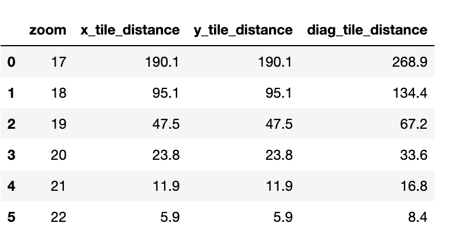
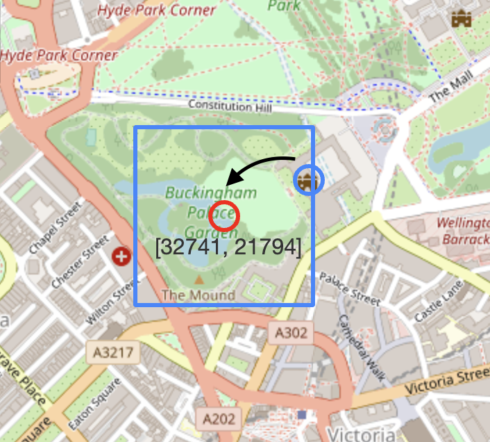
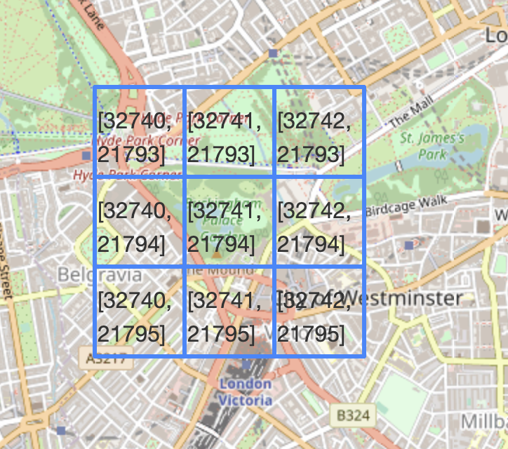

## Description:
GIS data science by applying discrete tiles transformation to GPS coordinates.

## When you can use this approach:
For System architect and enigineers(Software, engineers, Data engineers):
- This approach is SQL and Spark friendly;
- Faster computation time, because you are using discrete proxies of areas and not real complex Polygons;  
- Quicker for prototyping any 2GIS solutions; 

Use cases and Data Science applications:
- Analyze customers GPS tracks (convert their tracks to tiles):
    - Find customers with similar GPS tracks
    - Find if two customers have GPS tracks belond to same customers
    - Find anchor locations for each customer such as home, work locations
    - Calculate how often each customer visit bank, supermarket and etc.
- Find best locations for openning new bank office, grocery store, restaurant, hotel;
    - count POIS (bars, banks, grocery stores, etc) in some radius for given locations;
- Analyse SME default probabilities:
    - Number of similar businesses around the client location
    - Types of businesses around the client location

## Examples
You can select tiles granularity by passing zoom attribute. Tile can be 100 meters width at zoom level 18 down to 6 meters width with zoom level 22: 

Convert POI to tile (All POIs in the tile are associated with the tile center): 

Tiles have X and Y coordinates and work very much as normal 
coordinate systems: 

## Math behind tiles conversion
Code is reusing approach from the OpenStreetMap: 
https://wiki.openstreetmap.org/wiki/Slippy_map_tilenames

## If you like this library:
You can help in developing and maintaining this library by:
- adding star to the repository;
- writing review by suggesting a feature or reporting an issue;

