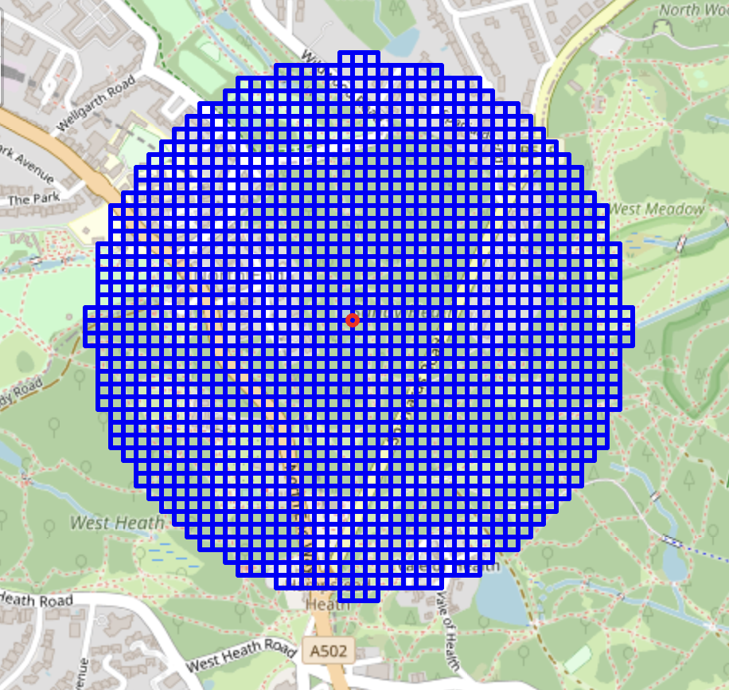
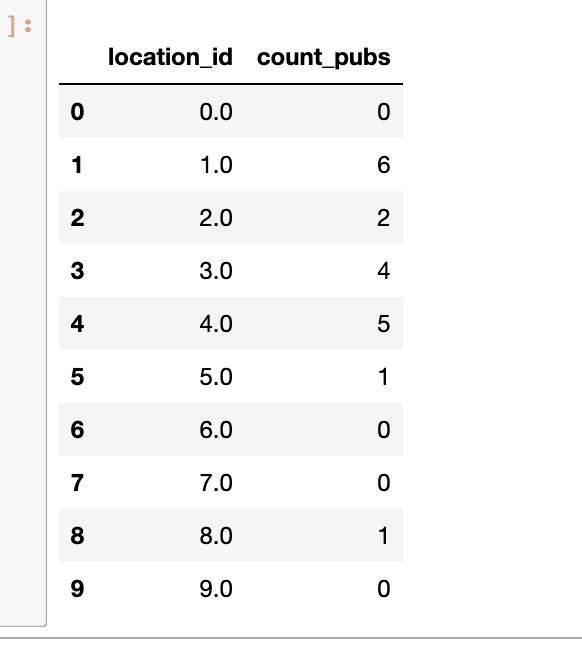

## What is this
GIS data science using geohashing tricks. Applying to GPS coordinates transformation which outputs discrete tiles. Numpy based library.

## When you could use this approach
Software engineers and data engineers:
- This approach is SQL and Spark friendly - you only need to store integer hashes of your locations;
- Faster computational time - instead of complex Polygons you are using discret proxy of each object;  
- If you are using gps tracks or nay gps locations in your work you will find this approach a much quicker for prototyping 2GIS solutions; 

Use cases and Data Science applications:
- Analyze customers GPS tracks (convert their tracks to tiles and later compare):
    - Find customers with similar GPS tracks
    - Find if two given GPS tracks belong to single customers
    - Find anchor locations for a customer: such as home, work locations
    - Calculate how often each customer visit different pois: banks, supermarkets and etc.
- Find best locations for openning new bank office, grocery store, retail store, restaurant, hotel;
    - count POIS (bars, banks, grocery stores, etc) in a radius for each location in the town of interest;
- Analyse location where SME (small/medium business) is registered or selling to estimate probability of default:
    - Number of similar businesses around the client location
    - Types of businesses around the client location

## Tutorial
`Tutorial.ipynb` - provides detailed explanation how to use the library.

## Examples
You can select tiles granularity by passing zoom attribute. Tile can be 100 meters width at zoom level 18 down to 6 meters width with zoom level 22: 

Convert POI to a tile (All POIs within a tile will have same X,Y coordinates): 

Tiles have X and Y coordinates and work very much as normal 
coordinate systems: 

Given a tile get all it's neighbours in some radius: 

Calculate number of poi in some radius from list of given locations: 

## Math behind tiles conversion
Code is reusing hashing approach described by the OpenStreetMap: 
https://wiki.openstreetmap.org/wiki/Slippy_map_tilenames

## If you like this library:
You can help in developing and maintaining this library by:
- adding star to the repository;
- writing a review, suggesting a feature or reporting an issue;

